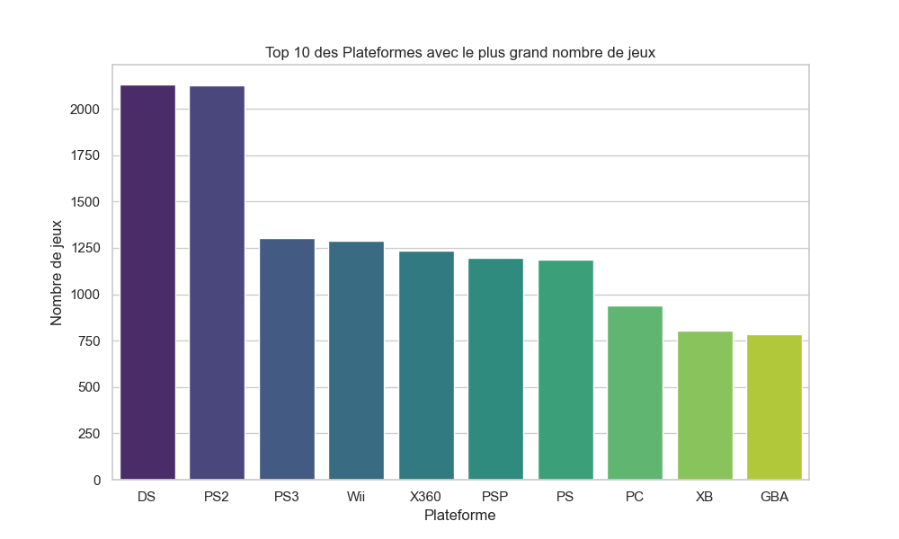
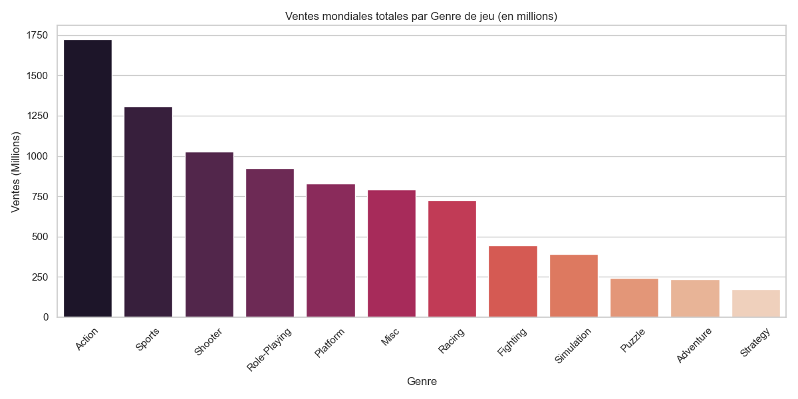

# 🎮 Analyse du Marché Mondial du Jeu Vidéo (1980 - 2020)
> **Projet Data Science & Business Intelligence** > *Technologies utilisées : Python, Pandas, NumPy, Seaborn, Matplotlib*

---

## 📌 Présentation du Projet
L'objectif de ce projet est d'extraire des indicateurs clés (KPI) à partir d'un jeu de données de **16 500 titres**. Ce travail simule une mission d'analyste consistant à identifier les leviers de succès commerciaux pour orienter les futurs investissements d'un studio de développement.

## 🛠️ Stack Technique & Compétences
Ce projet met en œuvre les piliers de la Data Analyse :
* **Nettoyage de données (Data Cleaning) :** Traitement des valeurs manquantes et formatage via `Pandas`.
* **Analyse Statistique :** Utilisation de `NumPy` pour le calcul de métriques (Record de ventes, moyennes pondérées).
* **Dataviz (Visualisation) :** Création de graphiques complexes avec `Seaborn` pour rendre la donnée "parlante".

---

## 🔍 Analyses Clés & Visualisations

### 1. Domination des Plateformes
Le premier graphique identifie les écosystèmes les plus porteurs. On observe une concentration historique sur les consoles de salon (PS2, DS, PS3).

### 2. Rentabilité par Genre
L'analyse montre que les jeux d'**Action** et de **Sport** dominent largement le marché mondial en volume de ventes. C'est un indicateur crucial pour la gestion des risques lors du lancement d'une nouvelle licence.

---

## 📈 Résultats du Script
Lors de l'exécution, le programme extrait automatiquement les records du dataset :
* **Record de ventes :** 82.74 Millions d'unités (Wii Sports).
* **Volume traité :** +16 000 lignes de données historiques.

---

## 🚀 Comment lancer l'analyse ?
1. Cloner le dépôt : `git clone https://github.com/ton-pseudo/nom-du-repo.git`
2. Installer les dépendances : `pip install pandas numpy seaborn matplotlib`
3. Lancer le script : `python analyse.py`

---
**Contact :** Baccouche Hamza – Étudiant en Cycle d'Ingénieur Informatique à l'ESIEE-IT

